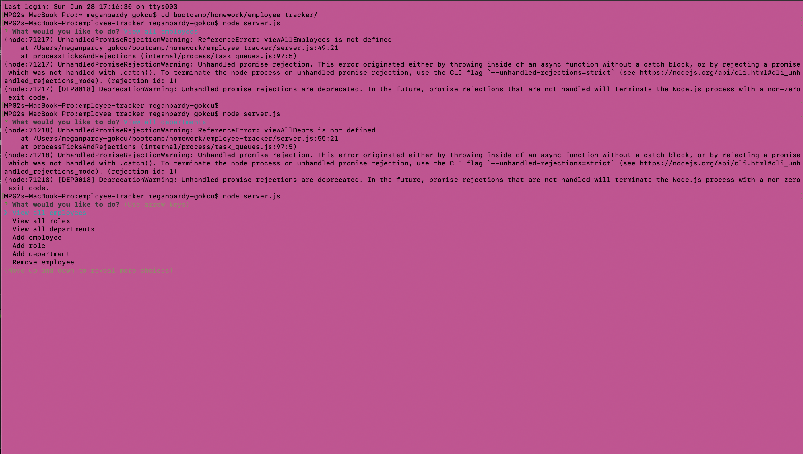
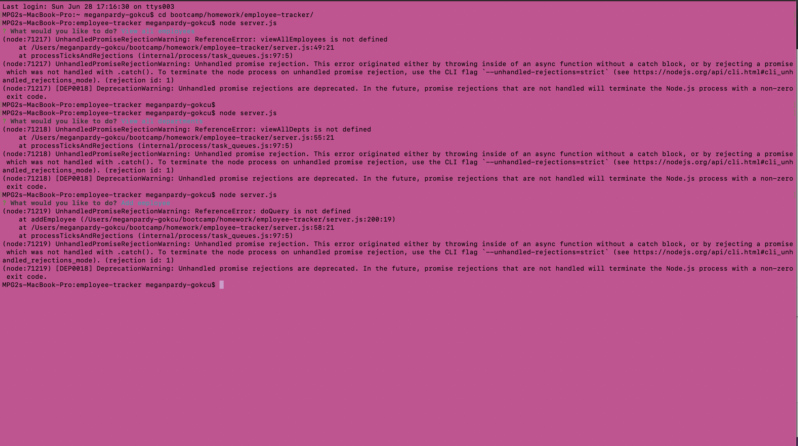

# employee-tracker

The employee tracker should allow you to view this companies employees in the terminal. The
app should also allow employees to be added, deleted, as well as their departments, roles, etc. 

#Built With
-Node.js
-Express
-MySQL

